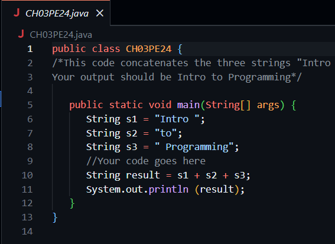
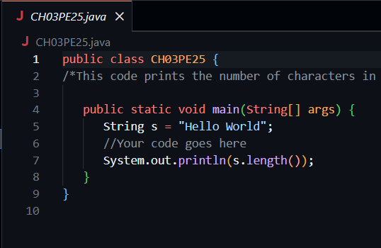
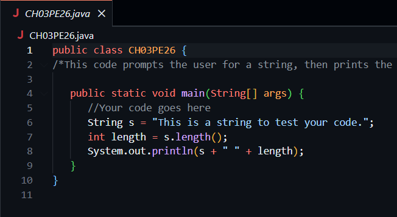
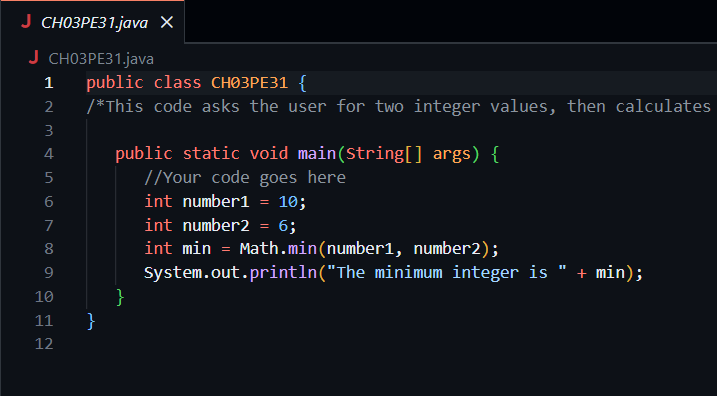
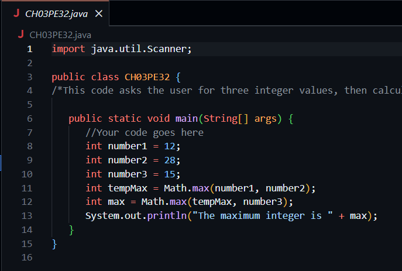

# Chapter 3 Java Practice
This assignment was given to me in my CSCI 160 class.
## Original Instructions
- CH03PE24: Display "Intro to Programming"  
- CH03PE25: Output the number 11  
- CH03PE26: Process and display a string with its length  
- CH03PE31: Determine the minimum of two integers  
- CH03PE32: Determine the maximum of three integers 
## How My Solution Works
Please see pictures below to learn how I completed these examples for chapter 3:

## Final Thoughts
I really enjoyed doing these examples it helped me learn some mathematical equations while also getting more familiar with strings!
